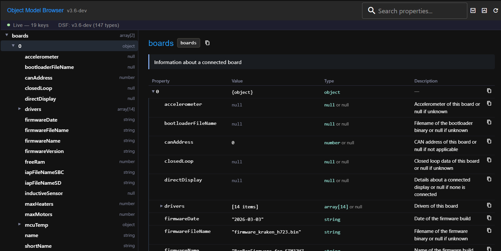

# RRF Alternative Object Model Browser

A DuetWebControl (DWC) plugin that provides a richer Object Model browser than the one built into DWC.



## Features

- **Split-pane layout** — navigable tree on the left, property detail table on the right
- **Live mode** — when a printer is connected, shows real-time values from the live object model with their types, updating live (throttled)
- **Reference mode** — when offline, shows the full typed object model schema with descriptions sourced from the DSF C# XML docs (147+ types)
- **Inline drill-down** — expand objects and arrays inline in the detail panel without leaving the current view
- **Property search** — search class names, property names, types and descriptions, plus live matches against the connected model's paths and values
- **Watch list** — pin live values (📌) to a panel that tracks them in real time
- **Path & JSON export** — copy any path, copy or download the selected subtree as JSON, or copy a deep link
- **Deep linking** — the selected live path is reflected in the URL (`?path=…`) so views can be shared/bookmarked
- **Keyboard navigation** — arrow keys to move/expand/collapse in the tree, Esc to clear search
- **SBC property tags** — properties flagged as SBC-only or SBC-capable are labelled in the detail panel
- **Theme-aware** — follows the active DuetWebControl light/dark theme
- **Resizable tree panel** — drag the divider to adjust the split (width is remembered)

## Requirements

- DuetWebControl 3.7 or later (the Vue 3 / Vuetify 4 stack). For the older Vue 2 DWC 3.6, use the
  `main` branch; this `Next` branch targets the rebuilt Vue 3 DWC.
- Node.js (to run the prebuild script and the plugin build)

## Building the plugin

### 1. Regenerate model data (when updating to a new firmware version)

```bat
node prebuild.js
```

This reads the TypeScript ObjectModel sources from `om-src/`, fetches the DSF C# XML documentation from GitHub, and writes `src/model-data.js`. Commit the updated `om-src/` sources alongside any schema changes.

### 2. Build the plugin ZIP

```bat
build.bat
```

This requires DuetWebControl to be checked out locally. Edit the `DWC_DIR` variable at the top of `build.bat` to point to your local DWC source folder. The script will build the plugin and copy the resulting ZIP to this folder.

The ZIP file is excluded from version control — attach it to a GitHub Release for distribution.

## Installation

1. Download the latest `OmBrowser-x.x.x.zip` from the [Releases](../../releases) page
2. In DWC, go to **Settings → Plugins → External plugins**
3. Click **Install plugin** and upload the ZIP

## Standalone viewer

A standalone HTML viewer (`viewer/index.html`) is also included. Open it directly in a browser — no build step or server needed. It parses the same TypeScript sources and DSF docs client-side and provides a read-only reference browser without requiring a printer connection.

## Development

The plugin source lives in `src/`:

| File | Purpose |
|------|---------|
| `src/OmBrowser.vue` | Main component (`<script setup lang="ts">`) — tree, detail panel, search, watch list, resize |
| `src/index.ts` | DWC plugin entry point (route, i18n, persisted UI state) |
| `src/i18n/en.json` | Translatable UI strings |
| `src/model-data.d.ts` | Types for the generated data bundle |
| `src/model-data.js` | Auto-generated model + descriptions bundle (gitignored) |

`prebuild.js` generates `model-data.js` by:
1. Parsing all `.ts` files under `om-src/` to extract class and enum definitions
2. Fetching C# XML doc comments from the [DuetSoftwareFramework](https://github.com/Duet3D/DuetSoftwareFramework) repo on GitHub
3. Writing the merged output as a single ES module

## License

LGPL-2.1
